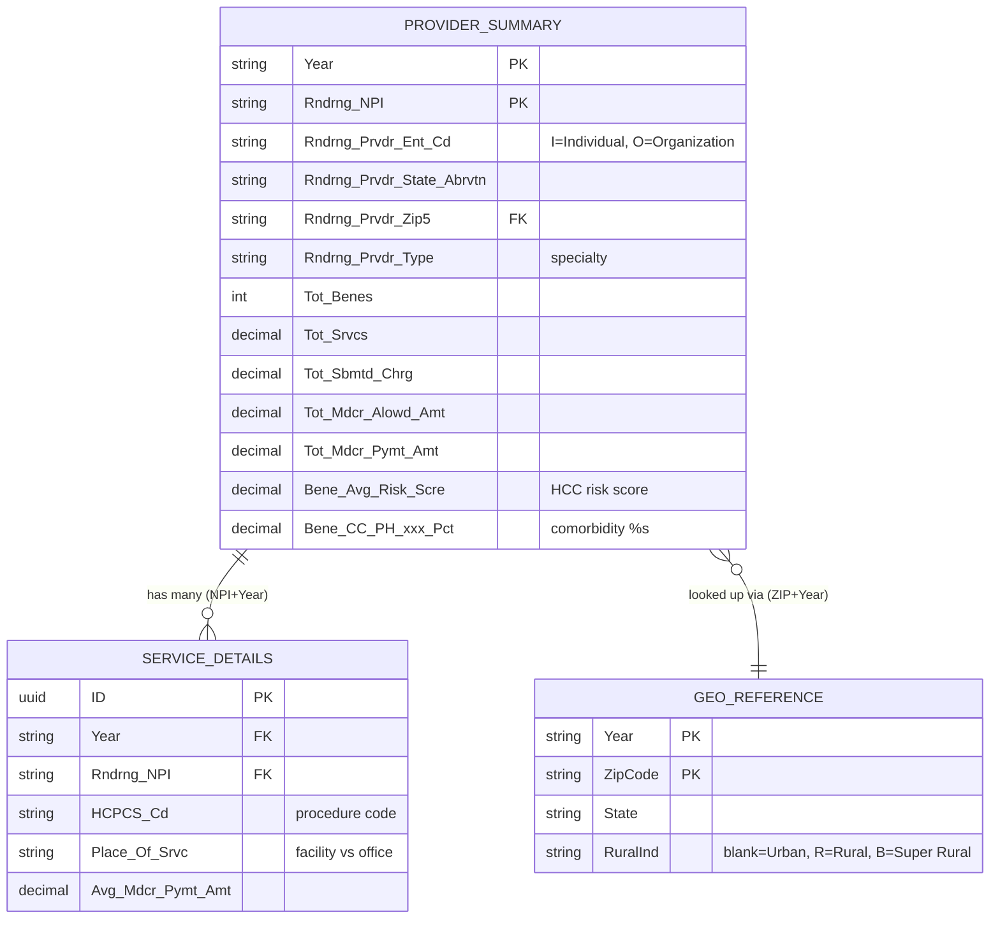

# Healthcare Audit Assistant — Technical Architecture & Data Model

> A complete, beginner-friendly walkthrough of how this SAP CAP application is built:
> the data schema, the analytical views, the OData V4 service layer, and how it all
> runs locally and on SAP BTP. If you have never seen this codebase before, read this
> top to bottom and you will understand **what** was built, **why**, and **how it works**.

---

## Table of Contents
1. [What this application is](#1-what-this-application-is)
2. [The big picture: layers & request flow](#2-the-big-picture-layers--request-flow)
3. [Technology stack](#3-technology-stack)
4. [The data schema (db layer)](#4-the-data-schema-db-layer)
5. [Data cleansing & normalization](#5-data-cleansing--normalization)
6. [Analytical views explained](#6-analytical-views-explained)
7. [The OData V4 service layer](#7-the-odata-v4-service-layer)
8. [Aggregation annotations — the heart of the analytics](#8-aggregation-annotations--the-heart-of-the-analytics)
9. [The golden rule: ratio-of-sums vs average-of-ratios](#9-the-golden-rule-ratio-of-sums-vs-average-of-ratios)
10. [The UI / app layer (Fiori Elements)](#10-the-ui--app-layer-fiori-elements)
11. [Deployment architecture (BTP / Cloud Foundry)](#11-deployment-architecture-btp--cloud-foundry)
12. [How to run it locally](#12-how-to-run-it-locally)
13. [Glossary](#13-glossary)

---

## 1. What this application is

The **Healthcare Audit Assistant** is an analytical application built on the **SAP Cloud Application Programming Model (CAP)**. It ingests the public **CMS Medicare Physician & Other Practitioners** dataset (years 2019–2023) and turns millions of raw billing rows into structured, explorable analytics for **auditing** — finding providers, specialties, and regions whose cost, utilization, or patient-risk patterns stand out.

It answers questions like:
- Which states/specialties concentrate Medicare spend?
- How does cost differ between urban and rural providers?
- Which providers are cost-efficiency outliers?
- Do organizations bill differently from individual clinicians?

---

## 2. The big picture: layers & request flow

CAP applications are organized in three layers. This repo follows that convention exactly:

```
┌──────────────────────────────────────────────────────────────┐
│  app/   →  UI layer: 7 Fiori Elements apps + approuter         │
│            (tables, charts, KPIs — defined via UI annotations)  │
├──────────────────────────────────────────────────────────────┤
│  srv/   →  Service layer: OData V4 service "MedicareService"    │
│            (exposes entities + views, + aggregation metadata)   │
├──────────────────────────────────────────────────────────────┤
│  db/    →  Data layer: CDS schema (3 entities + 6 views)        │
│            + CSV seed data                                       │
└──────────────────────────────────────────────────────────────┘
```

**What happens when a user opens a chart:**

1. The browser loads a **Fiori Elements** app from `app/` (e.g. `cost-analysis`).
2. Fiori reads the **UI annotations** (which chart, which table columns) and the
   **service metadata** (`$metadata`) to learn what it can query.
3. Fiori sends an **OData V4** request to `/medicare/...` — typically an **`$apply`**
   query asking the server to *group and aggregate* the data.
4. The CAP service translates that into SQL against the database (SQLite locally,
   SAP HANA in the cloud), runs it, and returns JSON.
5. Fiori renders the result as a chart/table.

The key idea: **aggregation happens in the database**, not the browser. The UI just
describes *what* it wants; CAP + OData figure out *how* to compute it.

---

## 3. Technology stack

| Concern | Technology | Where |
|---|---|---|
| Application framework | SAP CAP (`@sap/cds` v9) | whole project |
| Data modelling language | CDS (Core Data Services) | `db/`, `srv/` |
| Local database | SQLite (`@cap-js/sqlite`) | dev only |
| Production database | SAP HANA Cloud (`@cap-js/hana`) | BTP |
| UI framework | SAP Fiori Elements (SAPUI5) | `app/*` |
| App routing / auth gateway | SAP Approuter | `app/router` |
| Authentication | XSUAA (OAuth2) | production only |
| Cloud packaging | MTA (Multi-Target App) | `mta.yaml` |
| Target platform | SAP BTP, Cloud Foundry runtime | — |

A useful detail: **there are no custom Node.js handlers** (`srv/*.js`). The entire
service is **declarative** — defined purely in CDS and annotations. All the analytics
are expressed as CDS **views** plus **aggregation annotations**, which keeps the
backend simple and pushes computation into SQL.

---

## 4. The data schema (db layer)

File: `db/schema.cds` (namespace `medicare`).

The model is a small **star schema**: one central *fact* table of provider activity,
a service-detail fact, and a geographic *dimension* used for lookups.



`ProviderSummary` is the **hub** of the star: the six analytical views are all built
on top of it, joining out to `GeoReference` only when geography is needed.

### 4.1 `ProviderSummary` (primary fact)
One row **per provider per year**. This is the workhorse table.

- **Key:** `Year` + `Rndrng_NPI` (NPI = National Provider Identifier).
  The composite key with `Year` is deliberate: it lets every view trend across
  2019–2023 without separate tables per year.
- **Identity/locality:** name, credentials, **entity code** (`Rndrng_Prvdr_Ent_Cd`:
  `I` = individual clinician, `O` = organization), city, state, ZIP, specialty type.
- **Volume & money measures:** `Tot_Benes` (beneficiaries), `Tot_Srvcs` (services),
  `Tot_Sbmtd_Chrg` (submitted charges), `Tot_Mdcr_Alowd_Amt` (allowed),
  `Tot_Mdcr_Pymt_Amt` (actually paid).
- **Patient-mix measures:** demographics, dozens of **chronic-condition percentages**
  (`Bene_CC_PH_*_Pct` — diabetes, hypertension, CKD, heart failure, …) and the key
  **`Bene_Avg_Risk_Scre`** (CMS HCC risk score; 1.0 ≈ a national-average-cost patient).

### 4.2 `ServiceDetails` (service-level fact)
One row per **provider × HCPCS procedure code** per year — the most granular table.
Where `ProviderSummary` says *"this provider was paid $X in total,"* `ServiceDetails`
breaks that down into *"$a for procedure 99213, $b for procedure 73721, …"*.

Key fields and why they matter:
- **`HCPCS_Cd` / `HCPCS_Desc`** — the specific procedure billed. Lets analysis go
  below the provider level to individual services.
- **`Place_Of_Srvc`** — **facility** vs **office**. This is central to Task 3: the
  same procedure is reimbursed differently depending on where it's performed, so this
  field drives the "does place of service explain payment differences?" analysis.
- **`Avg_Sbmtd_Chrg` / `Avg_Mdcr_Alowd_Amt` / `Avg_Mdcr_Pymt_Amt`** — per-service
  averages, used to compare *submitted vs allowed vs paid* (the charge-to-payment gap).
- **`Tot_Bene_Day_Srvcs`** — distinct service days, a finer utilization signal.

It links back to its provider via the `provider` association (same `NPI + Year`).
Currently it underpins the **upcoming Task 3 (association) analysis**; the Task 1/2
views all build on `ProviderSummary`.

### How the CSV data actually loads
There is no import script. CAP uses a **naming convention**: any file in `db/data/`
named `<namespace>-<Entity>.csv` is auto-deployed into the matching entity at startup.
That is why the files are named exactly:

```
db/data/medicare-ProviderSummary.csv   → entity medicare.ProviderSummary
db/data/medicare-ServiceDetails.csv    → entity medicare.ServiceDetails
db/data/medicare-GeoReference.csv      → entity medicare.GeoReference
```

On `cds watch` the data is loaded into the in-memory/SQLite store; on BTP the
`db-deployer` module loads it into HANA. The CSV header row must match the entity's
element names — aligning the raw CMS headers to these names was part of the cleansing
step (§5).

### 4.3 `GeoReference` (dimension)
A ZIP-to-locality lookup derived from the official **CMS Zip Code to Carrier Locality
File**. Keyed by `Year` + `ZipCode`, it carries the crucial **`RuralInd`** rural
indicator.

### 4.4 Associations (how the tables relate)
CDS **associations** are declarative joins you can navigate by name:

```91:93:db/schema.cds
  geo      : Association to GeoReference
               on  geo.ZipCode = Rndrng_Prvdr_Zip5
              and  geo.Year    = Year;
```

- `ProviderSummary.services` → many `ServiceDetails` (same NPI + Year)
- `ProviderSummary.geo` → one `GeoReference` (same ZIP + Year)
- `ServiceDetails.provider` → back to `ProviderSummary`

These let views join on a human-readable path instead of repeating join conditions.

---

## 5. Data cleansing & normalization

The raw CMS extracts were large and messy. Three normalization problems were solved
so the analytics are trustworthy:

1. **Schema/CSV alignment & column stripping.** Inconsistent CSV headers were mapped
   onto the CDS field names, audit-irrelevant columns were dropped, and the five
   annual files were consolidated under the single `Year`-keyed model.

2. **Geographic normalization.** Provider ZIPs are joined to `GeoReference` to classify
   each provider as **Urban / Rural / Super Rural / Unknown** using the CMS spec
   (blank = Urban, `R` = Rural, `B` = Super Rural). See §6.2 for the subtle
   `NULL`-handling bug that was fixed here.

3. **Ratio normalization.** Every "per beneficiary" metric is computed as a
   **ratio of sums**, never an average of per-row ratios (see §9 — this is the single
   most important correctness concept in the project).

---

## 6. Analytical views explained

Views are **virtual, read-only tables** computed from `ProviderSummary` on demand.
Six were built: three for **Task 1 (visualization)** and three for **Task 2
(classification)**.

### Task 1 views

#### 6.1 `CostByStateProviderType`
- **What:** spend rolled up to `Year + State + ProviderType`.
- **Why:** the core "where does the money go?" view — powers cost-hotspot charts/KPIs.
- **How:** `GROUP BY` with `sum()` of submitted/allowed/paid + `count()` of providers.

#### 6.2 `RuralUrbanDistribution`
- **What:** spend & risk per `Year + State + Rural/Urban bucket`.
- **Why:** quantifies the urban/rural disparity in Medicare delivery.
- **How:** `LEFT JOIN` to `GeoReference`, then a `CASE` maps `RuralInd` to a label.
  A subtle but important rule is encoded here:

```190:195:db/schema.cds
    key case
          when g.ZipCode is null  then 'Unknown'
          when g.RuralInd  = 'R'  then 'Rural'
          when g.RuralInd  = 'B'  then 'Super Rural'
          else                         'Urban'
        end                         as RuralUrban : String,
```

  Only a ZIP with **no match at all** (`g.ZipCode is null` after the LEFT JOIN) is
  "Unknown". A matched row with a *blank* `RuralInd` is genuinely **Urban** — these
  two must not be conflated (an earlier bug did exactly that).

#### 6.3 `RiskScoreDistribution`
- **What:** providers bucketed into 5 risk **bands** per `Year + State + ProviderType`.
- **Why:** turns 50k provider rows into a light, chartable **histogram** of patient
  complexity.
- **How:** a `CASE` on `Bene_Avg_Risk_Scre` assigns each provider to a band, then
  `GROUP BY` counts providers/beneficiaries per band. Band labels are prefixed
  `1 - … 5 - …` so they sort correctly in charts.

### Task 2 views (classification)

#### 6.4 `ProviderCostEfficiency`
- **What:** the **only non-aggregated view** — one row *per provider*, decorated with
  three derived classification labels.
- **Why:** lets auditors filter/triage individual providers by behaviour.
- **How:** three `CASE` expressions derive:
  - `RiskCategory` — Low / Moderate / High / Very High (cut points 1.0 / 1.5 / 2.0).
  - `EfficiencyCategory` — Highly Efficient → Outlier, based on cost/beneficiary.
    Thresholds (`150 / 300 / 600 / 900`) are **percentile-anchored** to the real
    distribution (≈ p45/p75/p90/p95), so "Outlier" = genuine top ~5%.
  - `UtilizationCategory` — Low / Moderate / High, by services/beneficiary (cuts at
    5 and 15 ≈ p75/p90).

```280:285:db/schema.cds
    case
      when p.Bene_Avg_Risk_Scre < 1.0 then 'Low Risk'
      when p.Bene_Avg_Risk_Scre < 1.5 then 'Moderate Risk'
      when p.Bene_Avg_Risk_Scre < 2.0 then 'High Risk'
      else 'Very High Risk'
    end                                       as RiskCategory       : String,
```

#### 6.5 `SpecialtyRiskProfile`
- **What:** one row per `Year + ProviderType` (specialty), with a derived
  `ComplexityTier`.
- **Why:** answers "is *Internal Medicine* a high-complexity specialty?" rather than
  judging one provider.
- **How:** aggregates avg risk, comorbidity %, provider count, and a ratio-of-sums
  `AvgCostPerBene`; the `ComplexityTier` reuses the same 1.0/1.5/2.0 risk cut points
  as the provider-level tier, so the two are directly comparable.

#### 6.6 `OrganizationClassification`
- **What:** one row per `Year + State + EntityType` (Individual vs Organization).
- **Why:** a structural audit lens — do organizations bill/serve differently than
  individuals?
- **How:** maps `Rndrng_Prvdr_Ent_Cd` to `Individual`/`Organization`/`Unknown`, then
  aggregates volume, `CostPerBene` and `ServicesPerBene` (both ratios of sums) and
  `AvgRiskScore`.

### 6.7 Classification reference — every threshold in one place

All cut points were **validated against the actual distribution** of 50,000 providers,
not chosen arbitrarily. The `% of providers` column is the resulting spread.

**Risk Category / Specialty Complexity Tier** (field: `Bene_Avg_Risk_Scre`)

| Band | Threshold | % of providers | Rationale |
|---|---|---|---|
| Low Risk / Low Complexity | < 1.0 | 19.5% | CMS HCC **1.0 = national-average-cost patient**, so < 1.0 is below average |
| Moderate | 1.0 – 1.5 | 35.7% | the bulk of providers |
| High | 1.5 – 2.0 | 19.5% | meaningfully sicker panel |
| Very High | ≥ 2.0 | 25.3% | twice the average-cost complexity |

**Efficiency Category** (field: `cost per beneficiary = Tot_Mdcr_Pymt_Amt / Tot_Benes`)

| Band | Threshold | ≈ Percentile | % of providers | Rationale |
|---|---|---|---|---|
| Highly Efficient | < $150 | p45 | 43% | below the typical provider |
| Efficient | $150 – 300 | p75 | 30% | around the upper-middle |
| Average | $300 – 600 | p90 | 17% | elevated spend per patient |
| Inefficient | $600 – 900 | p95 | 5% | top decile of cost intensity |
| Outlier | ≥ $900 | top ~5% | 5% | statistically unusual — audit candidates |

> The efficiency bands were **recalibrated** from earlier round numbers
> ($500/1000/2000/5000), which lumped 87% of providers into one bucket and made the
> classification useless. Because cost/bene varies by specialty, this is a *relative
> cost-intensity* signal, not a pure efficiency verdict.

**Utilization Category** (field: `services per beneficiary = Tot_Srvcs / Tot_Benes`)

| Band | Threshold | ≈ Percentile | % of providers |
|---|---|---|---|
| Low Utilization | < 5 | p75 | 72.5% |
| Moderate | 5 – 15 | p75–p90 | 17.4% |
| High | ≥ 15 | p90 | 10.0% |

### 6.8 Worked example — one real provider, traced end-to-end

Take an actual 2023 row (a Diagnostic Radiology provider in California, entity code
`I`):

| Raw field | Value |
|---|---|
| `Tot_Mdcr_Pymt_Amt` (paid) | **$654,061.30** |
| `Tot_Benes` (beneficiaries) | **3,309** |
| `Tot_Srvcs` (services) | **30,164** |
| `Bene_Avg_Risk_Scre` | **1.6866** |
| `Rndrng_Prvdr_Ent_Cd` | **I** |

**Step 1 — derived ratios:**
```
CostPerBeneficiary = 654,061.30 / 3,309  = $197.66
ServicesPerBene    = 30,164     / 3,309  = 9.12
```

**Step 2 — apply the CASE classifications:**

| Classification | Test | Lands in |
|---|---|---|
| Efficiency | $197.66 is in $150–300 | **Efficient** |
| Risk | 1.6866 is in 1.5–2.0 | **High Risk** |
| Utilization | 9.12 is in 5–15 | **Moderate Utilization** |
| Entity | code = `I` | **Individual** |

So this single `ProviderSummary` row becomes, in `ProviderCostEfficiency`, a provider
tagged **Efficient / High Risk / Moderate Utilization** — i.e. *cost-reasonable, but
serving a high-complexity patient panel.* That is exactly the kind of nuanced profile
the classification is designed to surface for auditors.

**Step 3 — how it rolls up:** when a chart groups this provider with others (say, by
`State`), `ProviderCount` and `TotalPaid` are **summed**, while `CostPerBeneficiary`
is shown per-row (never averaged across the group — see §9).

---

## 7. The OData V4 service layer

File: `srv/medicare-service.cds`.

### 7.1 What is OData V4?
**OData** is a standardized REST protocol for querying data over HTTP. **V4** is the
modern version. Instead of writing custom endpoints, you expose entities and the
client can query them with URL parameters:

- `GET /medicare/CostByStateProviderType` — read rows
- `?$filter=Year eq '2023'` — filter
- `?$select=State,TotalPaid` — pick columns
- `?$orderby=TotalPaid desc` — sort
- `?$apply=groupby((State),aggregate(TotalPaid with sum as P))` — **group & aggregate**

CAP generates a full OData V4 service (including the `$metadata` document that
describes every entity, type, and capability) from the CDS definitions automatically.

### 7.2 Defining the service
The service is declared with a path and a set of **projections** onto the db entities
and views:

```3:19:srv/medicare-service.cds
service MedicareService @(path:'/medicare') {

  entity ProviderSummary  as projection on medicare.ProviderSummary;
  entity ServiceDetails   as projection on medicare.ServiceDetails;
  entity GeoReference     as projection on medicare.GeoReference;

  @readonly
  @cds.redirection.target: false
  entity CostByStateProviderType  as projection on medicare.CostByStateProviderType;
  ...
```

Two annotations matter here:
- **`@readonly`** — the analytical views are query-only; no inserts/updates/deletes.
- **`@cds.redirection.target: false`** — stops CAP from auto-redirecting associations
  to these views. Because several views derive from `ProviderSummary`, CAP might
  otherwise "helpfully" reroute navigation through them; this annotation keeps each
  view independent and predictable.

---

## 8. Aggregation annotations — the heart of the analytics

This is the part most people find confusing, so here it is in detail. For a chart to
ask the server *"group providers by EfficiencyCategory and sum their payments,"* the
OData service must **advertise** that it supports such queries. That advertisement is
done with three layers of annotations, all in `srv/medicare-service.cds`.

### 8.1 `@Aggregation.ApplySupported` — "you may group & aggregate me"
Declares which properties can be grouped (`GroupableProperties`) and which can be
aggregated (`AggregatableProperties`), and which transformations are allowed:

```40:52:srv/medicare-service.cds
annotate MedicareService.CostByStateProviderType with @(
  Aggregation.ApplySupported: {
    Transformations        : ['aggregate', 'groupby', 'filter'],
    GroupableProperties    : [Year, State, ProviderType],
    AggregatableProperties : [
      {Property: ProviderCount},
      {Property: TotalSubmitted},
      {Property: TotalAllowed},
      {Property: TotalPaid},
      {Property: TotalBeneficiaries},
      {Property: AvgRiskScore}
    ]
  }
);
```

This is what makes `$apply=groupby((State),aggregate(TotalPaid with sum as P))` legal.

### 8.2 `@Aggregation.CustomAggregate#<measure>` — "here is each measure's type"
Fiori Elements often issues a *bare* `aggregate(TotalPaid)` (no explicit `with sum`).
For the runtime to resolve that, it needs to know the **result data type** of each
measure:

```60:65:srv/medicare-service.cds
  Aggregation.CustomAggregate #ProviderCount      : 'Edm.Int32',
  Aggregation.CustomAggregate #TotalSubmitted     : 'Edm.Decimal',
  Aggregation.CustomAggregate #TotalAllowed       : 'Edm.Decimal',
  Aggregation.CustomAggregate #TotalPaid          : 'Edm.Decimal',
  Aggregation.CustomAggregate #TotalBeneficiaries : 'Edm.Int32',
  Aggregation.CustomAggregate #AvgRiskScore       : 'Edm.Decimal'
```

### 8.3 `@Analytics.Dimension` / `@Analytics.Measure` / `@Aggregation.default`
Finally, each property is tagged as a **dimension** (something you group by) or a
**measure** (something you aggregate), and each measure gets a **default aggregation
function**:

```69:78:srv/medicare-service.cds
  Year               @Analytics.Dimension: true;
  State              @Analytics.Dimension: true;
  ProviderType       @Analytics.Dimension: true;
  ProviderCount      @Analytics.Measure: true  @Aggregation.default: #SUM;
  TotalSubmitted     @Analytics.Measure: true  @Aggregation.default: #SUM;
  TotalAllowed       @Analytics.Measure: true  @Aggregation.default: #SUM;
  TotalPaid          @Analytics.Measure: true  @Aggregation.default: #SUM;
  TotalBeneficiaries @Analytics.Measure: true  @Aggregation.default: #SUM;
  AvgRiskScore       @Analytics.Measure: true  @Aggregation.default: #AVG;
```

- `@Analytics.Dimension/Measure` are required by the Fiori **chart** data handler
  (`sap.ovp.cards.v4.charts`) to tell axes (dimensions) from values (measures).
- `@Aggregation.default` decides how a measure collapses when grouped:
  - **Counts and money are `#SUM`** — they add up correctly.
  - **Risk scores and ratios are `#AVG`** — see the next section for the important
    caveat.

> **In short:** `ApplySupported` says *what's allowed*, `CustomAggregate` says
> *what type comes back*, and `Analytics`/`default` say *how to roll it up*. All three
> are needed for Fiori Elements analytical charts to work.

---

## 9. The golden rule: ratio-of-sums vs average-of-ratios

This is the project's most important analytical principle, and it appears all over the
code comments.

**A ratio (like cost-per-beneficiary) cannot be correctly aggregated by `SUM` or
`AVG` across rows.** There are two ways to compute a group's cost-per-beneficiary:

- **Ratio of sums** (correct): `SUM(paid) / SUM(beneficiaries)`
- **Average of ratios** (misleading): `AVG(paid / beneficiaries per row)`

They give different numbers. A tiny state with 1 provider and a freak $6,700/bene
ratio counts as much as a huge state in an unweighted average — inflating the result.
Real example from this data: averaging per-state ratios reported Organization
cost/bene as **~$650**, while the true ratio-of-sums is **~$354**.

**How the project handles this:**
- Inside the **views**, all per-bene metrics are computed as **ratio of sums** at the
  view's grain, so the stored value is exact:

```378:381:db/schema.cds
    cast(sum(p.Tot_Mdcr_Pymt_Amt) as Decimal) / nullif(sum(p.Tot_Benes), 0)
                                             as CostPerBene        : Decimal,
    cast(sum(p.Tot_Srvcs) as Decimal)        / nullif(sum(p.Tot_Benes), 0)
                                             as ServicesPerBene    : Decimal
```

  (`nullif(..., 0)` guards against divide-by-zero.)
- In **charts**, ratio measures are **not** plotted with a roll-up. Instead charts use
  summable measures (counts, totals) or a measure that is fair to average (the bounded
  risk score), and the exact ratio is read from the table at row grain.

---

## 10. The UI / app layer (Fiori Elements)

`app/` contains **seven Fiori Elements apps** (plus the approuter). Fiori Elements
means the UI is **generated from annotations** — there is almost no hand-written
JavaScript; you declare *what* to show and SAPUI5 builds the table/chart/page.

| App folder | Shows | Task |
|---|---|---|
| `task1-overview` | Overview page across Task 1 views | 1 |
| `cost-analysis` | Cost by state/provider type + KPIs | 1 |
| `1.2rural-analysis` | HCPCS overclaiming by structural tier + tier deviation | 1.2 |
| `risk-analysis` | Risk-score distribution | 1 |
| `2.1provider-classification` | Per-provider 2-Axis Risk Matrix (cost × utilization) | 2.1 |
| `2.2aspecialty-profiling` | Macro specialty peer deviation (cost × utilization vs baseline) | 2.2 |
| `organization-classification` | Individual vs Organization | 2 |

### 10.1 Where annotations live (and why it's split)
There are **two kinds** of annotations and they are kept in different files on purpose:

- **Service/data annotations** (aggregation metadata) → `srv/medicare-service.cds`.
- **UI annotations** (`UI.LineItem` tables, `UI.Chart`, `UI.KPI`, `UI.SelectionFields`,
  facets) → the app layer, mainly `app/cost-analysis/annotations.cds`.

`app/services.cds` simply imports each app's UI annotations:

```1:8:app/services.cds
using from './cost-analysis/annotations';
using from './2.1provider-classification/annotations';
using from './2.2aspecialty-profiling/annotations';
using from './organization-classification/annotations';
```

Keeping data concerns out of the UI files avoids duplicate/conflicting annotations —
which, as noted in §11, was a real source of bugs.

---

## 11. Deployment architecture (BTP / Cloud Foundry)

File: `mta.yaml` (Multi-Target Application descriptor). On SAP BTP the single project
deploys as several cooperating modules and managed services:

**Modules (deployable units):**
- `healthcare-audit-assistant-srv` — the CAP OData service (Node.js).
- `healthcare-audit-assistant-db-deployer` — pushes the schema/data into **HANA**
  (HDI container).
- `healthcare-audit-assistant` — the **Approuter**: the single public entry point that
  authenticates users and forwards UI/OData calls to the right backend.
- `…-app-content` / `commedicarecostanalysis` — builds and uploads the Fiori apps to
  the **HTML5 application repository**.

**Resources (managed services):**
- `…-auth` — **XSUAA** (OAuth2 authentication + the `admin` role collection).
- `…-db` — **SAP HANA Cloud** (HDI-shared).
- `…-repo-host` — HTML5 apps repository host.
- `…-destination-service` — destinations (e.g. to fetch UI5 from `ui5.sap.com`).

**Local vs cloud, at a glance:**

| | Local (dev) | BTP (production) |
|---|---|---|
| Database | SQLite | SAP HANA Cloud |
| Auth | none (mocked) | XSUAA / OAuth2 |
| UI serving | `cds watch` dev server | Approuter + HTML5 repo |
| Config switch | `@cap-js/sqlite` (devDep) | `@cap-js/hana` + `[production] auth: xsuaa` |

---

## 12. How to run it locally

```bash
# 1. Install dependencies
npm install

# 2. Start CAP with the local SQLite store + auto-served Fiori apps
npx cds watch
# server comes up on http://localhost:4004
```

Useful URLs once it's running:
- `http://localhost:4004` — service index (lists all entities & apps).
- `http://localhost:4004/medicare/$metadata` — the full OData V4 metadata document.
- `http://localhost:4004/medicare/OrganizationClassification?$top=5` — sample rows.
- Convenience scripts open a specific app, e.g.:
  ```bash
  npm run watch-organization-classification
  ```

Sanity-check an aggregation directly from the browser/curl:
```
GET /medicare/OrganizationClassification?$apply=groupby((EntityType),aggregate(TotalPaid with sum as P,TotalBeneficiaries with sum as B))
```

---

## 13. Glossary

| Term | Meaning |
|---|---|
| **CAP** | SAP Cloud Application Programming Model — the framework tying CDS, services, and DB together. |
| **CDS** | Core Data Services — the language used to define entities, views, and annotations. |
| **Entity** | A table-like data structure (e.g. `ProviderSummary`). |
| **View** | A virtual, read-only table computed from other entities via SQL. |
| **Projection** | Exposing an entity/view through a service, optionally renaming/filtering columns. |
| **Association** | A declarative, navigable relationship (join) between entities. |
| **OData V4** | The REST query protocol used to read the data over HTTP. |
| **`$apply`** | The OData query option that performs server-side `groupby`/`aggregate`. |
| **Dimension** | A field you group *by* (e.g. State, EntityType). |
| **Measure** | A numeric field you aggregate (e.g. TotalPaid, AvgRiskScore). |
| **HCC risk score** | CMS Hierarchical Condition Category score; ~1.0 = average-cost patient. |
| **NPI** | National Provider Identifier — unique ID per provider. |
| **Fiori Elements** | SAP UI framework that generates UIs from annotations. |
| **Approuter** | The BTP component that handles auth and routes requests to backends. |
| **XSUAA** | SAP's OAuth2 authorization service on BTP. |
| **MTA** | Multi-Target Application — the packaging format for BTP deployment. |
| **Ratio of sums** | The correct way to aggregate a per-unit ratio: `SUM(numerator)/SUM(denominator)`. |
